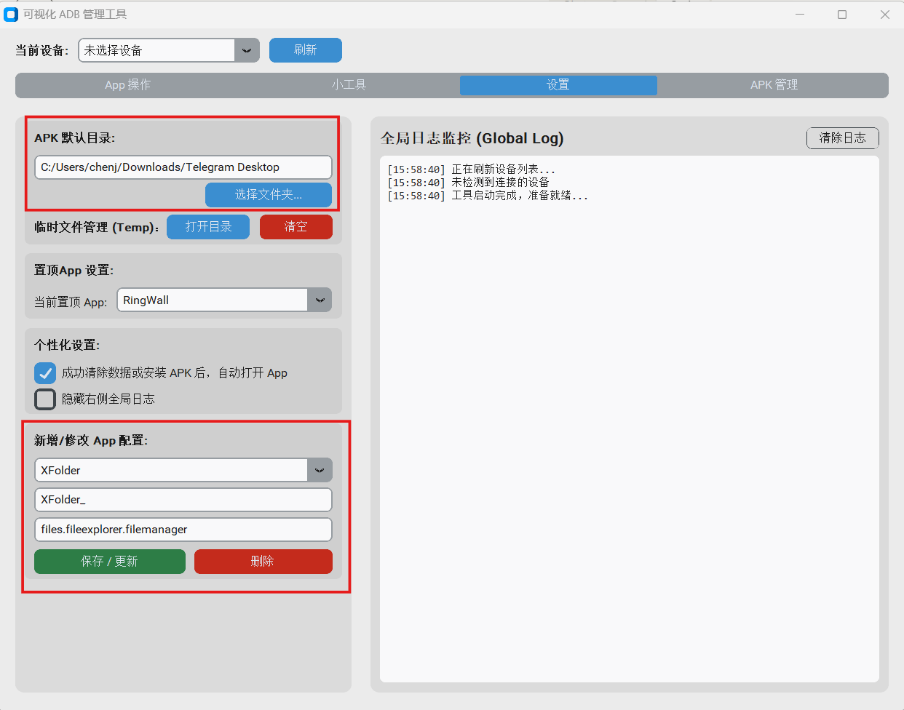

## ADB Helper

一款基于 Python 的 ADB 图形化工具，帮助你更方便地管理和调试 Android 设备。

### 主要功能

- **设备管理** — 自动检测已连接设备，支持多设备切换、USB 和无线调试
- **应用操作** — 安装、卸载应用，清除应用数据
- **智能安装** — 自动从指定目录获取最新 APK，一键安装，也支持拖拽安装
- **实时 Logcat** — 实时查看设备日志，支持按 Tag/级别过滤和关键词搜索
- **截图与录屏** — 一键截图并预览标注（矩形、箭头），支持屏幕录制保存 MP4
- **文件管理** — 浏览设备文件系统，支持文件推送、拉取和拖拽上传
- **APK 管理** — 浏览、筛选和批量删除本地 APK 文件
- **Firebase 监控** — 实时抓取和过滤 Firebase 事件日志
- **跨平台** — 支持 Windows 和 macOS，内置 ADB，开箱即用

---

## 🚀 初始化配置

首次使用前，需要在「设置」页面完成以下配置：



**1. APK 默认目录**

点击「选择文件夹...」，设置你存放 APK 文件的本地目录。设置后，「智能安装」功能会自动从该目录扫描最新的 APK 文件供你一键安装。

**2. 新增/修改 App 配置**

为你需要调试的 App 添加配置：
- **App 名称**（下拉框）：自定义一个易识别的名字，如 `XFolder`
- **APK 关键字**（第二行输入框）：用于从 APK 目录中筛选该 App 的安装包，如 `XFolder_`，只有文件名包含该关键字的 APK 才会出现在智能安装列表中
- **包名**（第三行输入框）：App 的完整包名，如 `com.example.app`，用于卸载、清除数据、查看 Logcat 等操作

填写完成后点击「保存 / 更新」即可。可添加多个 App 配置，在「App 操作」页面切换使用。

---

## 🪟 Windows 用户安装教程

**第一步：下载与运行**
1. 从 [Releases](https://github.com/super3hahaha/adb_helper/releases) 页面下载最新的 `ADBHelper-vX.X.X.exe` 文件。
2. 双击运行即可，无需安装。

**第二步：解除 Windows SmartScreen 拦截**

由于本软件为开源免费软件，未经过微软代码签名，首次运行时 Windows Defender SmartScreen 会弹出蓝色警告窗口：

*   提示 **"Windows 已保护你的电脑"**
    1. 点击弹窗中的 **"更多信息"** 链接。
    2. 点击出现的 **"仍要运行"** 按钮即可正常启动。

> 此提示仅在首次运行时出现，之后不会再弹出。

---

## 🍏 Mac 用户安装教程

**第一步：解压与安装**
1. 从 [Releases](https://github.com/super3hahaha/adb_helper/releases) 页面下载最新的 `ADBHelper-macOS-vX.X.X.zip` 文件。
2. 双击解压该文件，你会得到一个带图标的 `ADBHelper.app` （在 Mac 上可能只显示 `ADBHelper`）。
3. **关键操作：** 将提取出来的 `ADBHelper` 拖拽到 Mac 的 **“应用程序”（Applications）** 文件夹中。

**第二步：首次打开与解除苹果安全限制（但是似乎并没有碰到这种情况）**

由于本软件为开源免费软件，未经过 Apple 开发者账号签名，首次打开时系统会进行拦截。请根据你遇到的提示进行以下操作：

*   **情况 A：提示“无法打开，因为无法验证开发者”**
    *   **解决办法：** 打开 Mac 的 `系统设置` -> `隐私与安全性`，向下滑动找到安全性板块，会看到提示“已阻止使用 ADBHelper...”，点击旁边的 **“仍要打开”**。
    *   或者：在应用程序文件夹里，**按住键盘上的 `Control` 键**，再鼠标点击 `ADBHelper` 图标，在弹出的菜单中选择 **“打开”**，之后再点击确认“打开”即可。

*   **情况 B：提示“软件已损坏，无法打开。你应该将它移到废纸篓”**
    *   *（这是 Mac 对未经签名下载软件的默认保护机制，软件并没有真的损坏）*
    *   **解决办法：**
        1. 打开 Mac 自带的 **“终端” (Terminal)** 应用（可以在启动台搜索“终端”或者按 `Command+空格` 搜索）。
        2. 复制并粘贴以下命令（注意最后面 `ADBHelper.app` 名字要和你的实际名字一致，如果放在应用程序文件夹就是这个路径）：
           ```bash
           sudo xattr -cr /Applications/ADBHelper.app
           ```
        3. 按下回车键，输入你的 Mac 开机密码（输入时密码不可见，输完回车即可）。
        4. 再次去应用程序里双击打开软件，就可以完美运行了！
